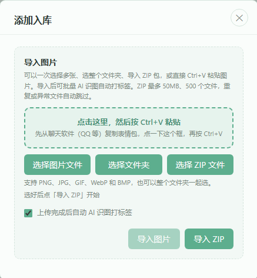
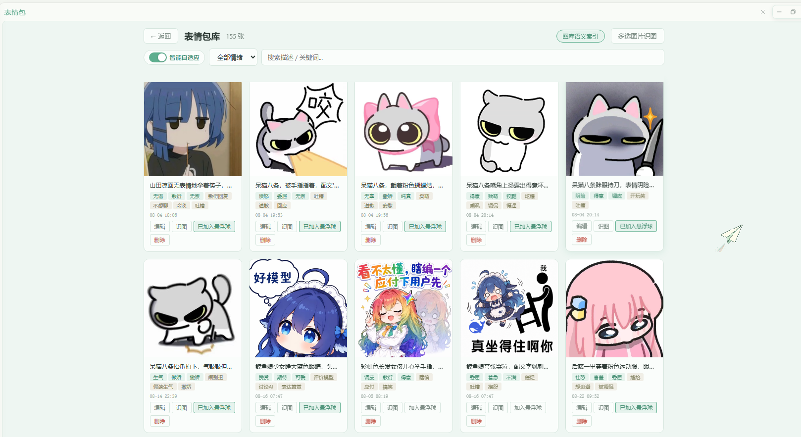
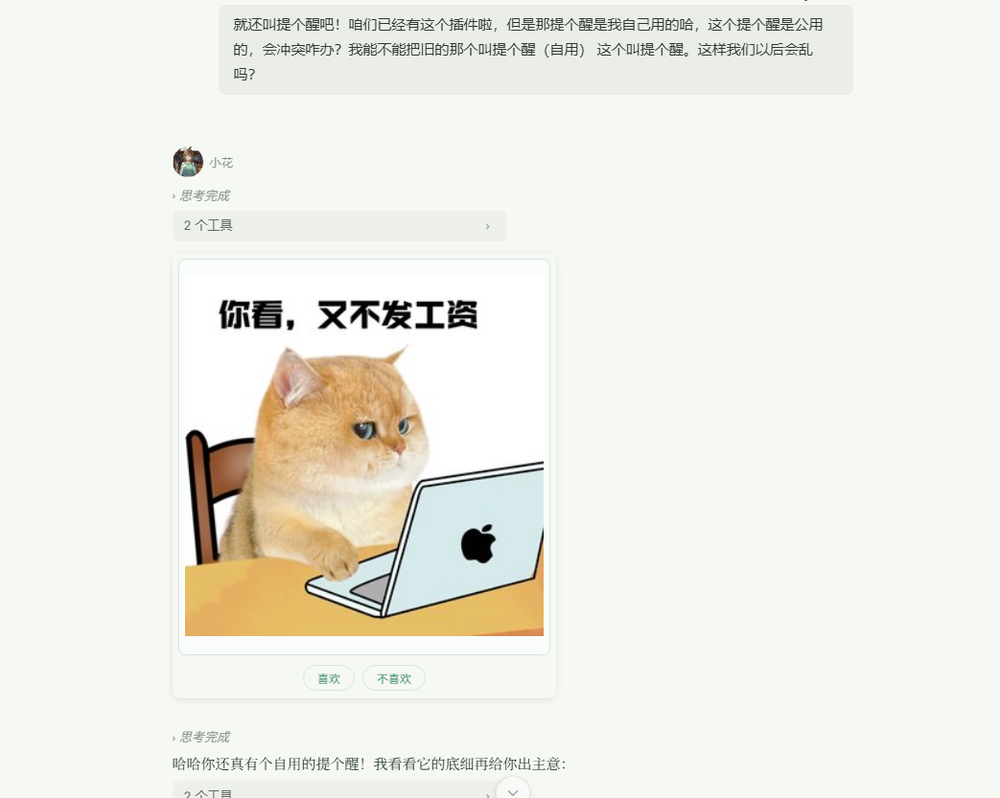
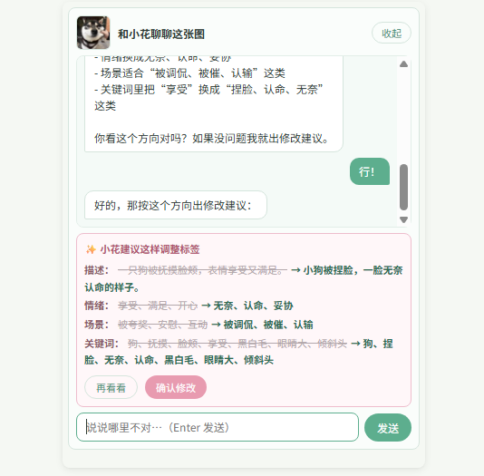
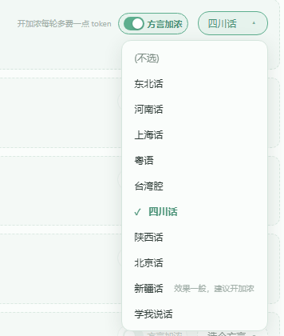
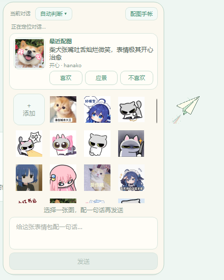
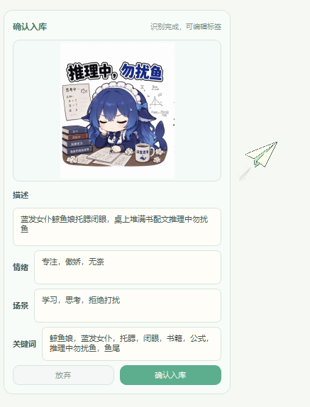
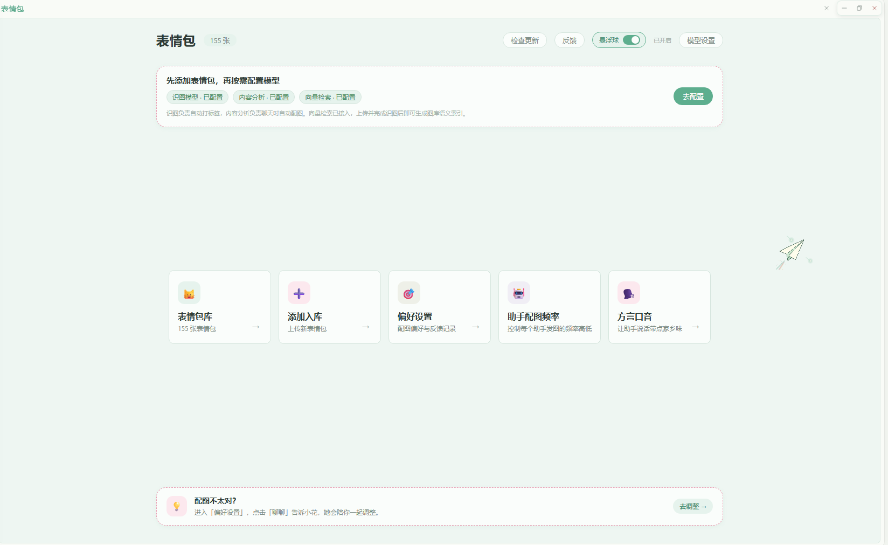

# 表情包（Hana v2 应用）

让 HanaAgent 里的伙伴，可以通过表情包表达自己的情绪与语气，而且越用越懂你。

一句话介绍它：**这是个养成系表情包应用**。它不替任何人准备一套现成的图库，给的是一个空的图库 + 一套会长大的机制。你喂给它的图片、识图、反馈和偏爱，会一天天把它养得越来越懂你；最开始可能有点不顺手，但用久了，它会慢慢长成你们俩之间的「表情语言」。

这是「表情包」的 **App 版**（Hana v2 应用，`manifestVersion: 2`）。早期那个插件版（`plugins/biaoqingbao`）仍在，功能与它基本一致，两代的关系见文末「项目关系」。

应用首次安装时图库为空。你可以上传自己收集、制作或有权使用的表情包，再通过 AI 识图、标签编辑和语义向量，让伙伴逐渐学会在合适的时候使用它们哈。

如果同时装了茶话会，偏好设置里还会单独列出「茶话会发过的表情包」。这份列表只读取茶话会导出的表情包 ID、伙伴和时间，图片、标签和聊天正文仍由各自边界管理。

## ⚠️ 用之前先知道这些

### 1. 应用不附带任何表情包

我没有给所有人预先决定一套图库。表情包本来就是很私人的语言，我更愿意把这个位置留给使用者，让伙伴逐渐认识属于你们的那些图~

第一次打开时看到空图库是正常的。你可以：

- 一次选择多张图片批量导入；
- 直接导入 ZIP 图片包；
- 之后继续随时添加、删除和整理图片；
- 在「表情包库」里用自定义分组整理图片，一张图可以放进多个分组。

### 2. 完整体验需要配置三个模型

打开应用首页会引导你配置：

- **识图模型**：理解图片内容，自动生成描述和标签；
- **内容分析模型**：分析聊天语境，以及伙伴此刻是否适合配图；
- **向量模型**：理解自然语言中「字面不同，但感觉相近」的表达。

内容分析默认关闭，不会在你不知情时自动调用。配置完成后，需要由你主动开启。

另外，「配图卡片上点不喜欢→和小花聊聊改标签」这件事会用到一个聊天模型，它**默认跟着这位伙伴平时说话那台模型走**，不用你单独配；想用别的模型也可以在设置里自己填。

没有配置模型时，手动上传、编辑标签和按照现有标签选图仍然可以使用。

### 3. 如果你把 HanaAgent 当作纯生产工具使用，请谨慎安装

这个应用主要面向陪伴和日常交流。启用后，伙伴可能会额外判断是否适合配图、搜索和调用表情包，也就是会分出一部分注意力处理这些事情。如果你主要用 HanaAgent 写代码、处理文件或做严肃分析，追求尽量纯粹的生产效率和稳定输出，请谨慎安装，或把对应伙伴的配图关掉。

### 4. （可选进阶）想要它「越用越准」，配一个向量模型

基础选图不依赖它：情绪标签、使用场景、关键词加上你的反馈，完全可以先用起来，图库小的时候尤其如此。

但向量模型承担一件更关键的事——**它是「教学样本」的前提**。你教过它「月薪喵」，以后同类图要自动带上你起的名字，靠的就是把识别结果和教学样本的语义向量做比对；没配向量模型，教学样本记不了也不比对（不会报错，只是悄悄不生效），「教一次越认越准」就成空话。它同时也能让选图理解「字面不同、感觉相近」的表达：你日常说「被鸽了」，它能匹配到标签为「委屈」的图。

具体用哪个向量模型，应用不做限定：任何支持文本嵌入（embedding）的模型都可以，按你手上已有的服务商来配就行，不用专门另开一个。上传并完成识图后，可以在图库页面为表情包生成语义索引。已经生成向量后，如果更换向量模型，需要重新生成整个图库的语义索引（旧的向量和新模型不互相兼容）。

### 5. 模型调用可能产生费用

- 识图模型只在手动识图或批量识图时使用；
- 内容分析启用后，会在聊天过程中调用；
- 向量模型会在生成索引和进行语义查询时调用。

建议给内容分析选择速度快、价格较低的模型。

### 6. 隐私与联网说明

- 应用是宿主托管的，**网络访问由 Hana 按白名单放行**，目前只允许访问这三个域名：`api.siliconflow.cn`、`api.typesafe.ai`、`api.github.com`。你在设置里填的模型地址如果不在其中，请求会被宿主拦下来（这是 App 版的机制，比插件版那种通配权限更紧）。
- 图库、图片、标签、分组定义、伙伴配图偏好、使用记录都存在本机的应用数据目录里（`app-data/biaoqingbao-app`），不上传；
- 自定义 API Key 保存在本地配置中，设置页面只显示脱敏占位符；
- 调用模型时，对应的文字或图片会发送给你选择的模型服务商；
- 应用不会附带开发者的聊天记录、伙伴配置、API Key、调试日志或历史备份；
- 除模型调用外，应用还会访问 `api.github.com` 查询有没有新版本（只读版本信息，不发送任何图库或聊天内容）；
- 应用通过宿主提供的接口读取伙伴列表、模型列表和会话信息（用来分开统计每位伙伴的配图偏好、把图送到当前对话），这些都走 Hana 自己的通道，不出本机。

### 7. 桌面悬浮球需要本机有 Python

纸飞机悬浮球是一个独立的桌面小窗口，由本机 Python 驱动，需要 **Python 3 + PyQt6**。没装的话悬浮球起不来，应用里其他功能（图库、识图、自动配图、聊天流里的配图卡片）都不受影响。

应用会自己探测本机解释器；探测不到时会给出提示，按提示装好即可。

### 8. 【重要！！！】方言口音会改动伙伴的人格文件

「方言口音」和「学我说话」功能，会把对应的方言设定或说话风格模板**写进对应伙伴的人格文件**，让 ta 打字时自然带点那个味道。这是**你主动开启才会发生**的事，不开启不碰。

- 写入的部分用标记块包起来，**只动应用自己的那一段，不会碰你写的内容**；
- 关闭方言后会自动移除，人格文件恢复原样；
- 改完需要**重启 Hana** 才生效。

这个机制本质上是在人格文件里注入一段设定提示词，不是给模型装了什么语音包，效果会因模型而异（新疆话就明确标注了「效果一般」）。

注入的文案有引导模型在做正事时不被影响，实际测试下来轻量化的正事环境效果还行，但严谨、严肃的场合我并没有测试（其实是我用不到这个场合，实在没法测…）建议正经场合别开哈。

## 安装

这是个 Hana v2 应用，不走插件市场，装法如下：

1. 打开 Hana 的**应用管理**，选择导入本地应用（安装包 ZIP 或指向本目录）；
2. 按提示完成审核，**逐项允许它申请的权限**。大概会看到这几类（界面上的说法可能略有出入，以你看到的为准）：
   - 让伙伴能用到这个应用提供的工具（`app/tools.expose-to-model`）；
   - 允许它改写伙伴自己发出的消息（`app/hooks.messages-post-assistant`，用于清理模型偶尔写出的伪标记）；
   - 允许它在这台电脑上启动程序（`app/process.spawn`，悬浮球要用）；
   - 读取伙伴列表、模型列表（`app/agents.read`、`app/models.read`）；
   - 读取和操作对话（`app/sessions.*`，把图送进当前对话）；
   - 在伙伴回复前后各插一步（`app/hooks.agent-pre-step`，情绪观察器）。
3. 装载成功后，左侧导航会出现「表情包」页面。

**换电脑或重装**：图库不在应用目录里，卸载应用不会删掉你的图。「数据与迁移」里的一键搬家包可以带着图片、标签、分组、偏好和教学样本走，导入到新环境会自动恢复。

## 卸载

在应用管理里卸载即可。应用数据（图库、图片、偏好、账本）留在 `app-data/biaoqingbao-app`，不会跟着删；要清干净的话，卸载后手动删掉这个目录（删之前确认你不需要里面的图）。

## 它不是图包，是会长大的系统

市面上很多表情包工具自带一套做好的图库，装上就能用。这个应用不一样：**它什么表情包都不带，给的是一个会成长的机制。**

它的成长靠三样东西：

1. **你的图**。图从你来。你上传什么、留下什么删掉什么，决定了这套系统的底色。
2. **你的反馈**。每次配图下方的「喜欢 / 应景 / 不喜欢」，都是在告诉它「这张对了，这张偏了」。点不喜欢还能直接聊一聊，把哪里不对讲给它听；你手动改过的名字和标签，更是会被它当成「教学」牢牢记住。我特意加了一个应景的选项。因为我实际遇到的情况：这张图我并不是特别喜欢，但真的很应景！点喜欢有点不甘心。所以应景按钮出现啦。它是告诉应用这张图很匹配这个场景，所以并不会单纯地给这张图片加权重。
3. **你的时间**。标签、场景、频率、语义向量，都会在使用里一点点校准。起初它可能发得不那么合意，但越用，它越知道你说的「委屈」是哪种委屈、「等回复」是哪种焦灼。

更细一点，这套成长是**按伙伴分开的**。每位伙伴各有各的喜好，都会长出专属自己的表情语言，不会互相串味；就算几个人共用一套图库，各自的偏好也互不污染。

一句话：**它不是替你准备好很多现成表情包的仓库，是你和你的伙伴一起养大的默契。**

## 它能做什么

### 🌱 你的图库，你自己养

本地上传，不需要图床：

- 单张上传、一次多选、整个文件夹、ZIP 图片包（最大 50MB / 2000 个文件）；
- 一键导出图库迁移 ZIP，图片、名称、描述、标签和分组随包带走，保存目录可手动填写或直接选择，换机器导入时自动恢复；
- 支持按一个或多个分组导出，重叠分组里的同一张图片只打包一次，并保留它的分组归属；导出窗口默认勾选「图库分组」，取消后仍会按范围导出图片，但不带分组归属；
- 直接从聊天软件（QQ 等）复制表情包，Ctrl+V 粘贴入库；
- 拖拽图片进应用页面也能直接入库；
- 支持 PNG、JPG、GIF、WebP、BMP，动图原样保留、能预览能播放；
- 重复图、异常图、加密文件自动跳过，不会污染图库。

### 🗂️ 自定义分组：给图库留几个抽屉

打开「表情包库」里的「分组管理」就能自己建分组，按角色、情绪、场景，或者你临时想到的任何标准整理。分组之间可以叠加；没有放进任何分组的图片会自动归到虚拟的「未分组」。

在「伙伴配图设置」页，点开某位伙伴的「配置图库」，可以打开「全部图库」开关让 ta 用整库（以后新建的分组也自动算进来），也可以关掉开关按分组挑，并给挑中的分组点星级。多个分组取并集；星级只给已勾选的分组加权，1 星稍微偏一点、2 星偏爱、3 星主推（一张图挂在多个加权分组时按最重的那一档算），不会让没勾的图进来。

### 📦 一键搬家包：整套默契一起带走

想换电脑、换 Hana 环境，或者只是把养好的图库复制一份？打开「数据与迁移」，导出一份一键搬家包就行。它会带上图片、名称、描述、标签、图库分组、伙伴配图偏好、教学文字样本、应景/曝光记录、伙伴配图自评、学我说话资料，以及方言、频率、显示和纸飞机常备图等相关设置。

导入时应用不迷信旧 ID，而是给每张图片算 SHA-256 哈希：同一张图在新图库里已经存在，就复用那张图；新图才分配新 ID。偏好、教学和反馈里的旧图片关联会一起换成新 ID；伙伴先按 ID 匹配，ID 变了再按唯一名称匹配，遇到同名歧义会停下来提示，不乱接。教学向量不直接搬旧的，导入后按当前环境的向量模型后台重建。

搬家包不包含 API Key、模型配置、聊天会话、日志、批量任务、机器路径或运行状态。普通旧 ZIP 仍然从「添加入库」导入，继续走原来的待识图流程；老图库里没有分组字段的图片会自动按「未分组」处理。

### 🧠 AI 识图，帮你认图

- 视觉模型为每张图生成描述和标签；
- 多选图片建立后台批量识图任务，关掉页面任务也继续跑；
- 失败项目可以重看、重识，识别结果随时手动改；
- 也可以托付给你信任的视觉模型，每张图判断它适合回复什么。

### 🏷️ 标签 + 语义双通道

选图时应用会综合参考：情绪标签、使用场景、关键词、图片描述、语义描述、向量相似度，以及你留下的反馈。

- **标签**负责稳定、直观的匹配；
- **语义向量**负责理解那些措辞不同、情绪却很接近的表达——你说「被鸽了」，它能匹配到「委屈」「等回复」的图；
- 配置好任意向量模型后，语义通道自动生效。

### 👍 每张配图都能反馈：喜欢 / 应景 / 不喜欢

聊天里每张配图下方都有三个按钮，点一下就是在训练它：

- **喜欢**：这张合口味；
- **应景**：这张出现在这里特别合适；
- **不喜欢**：这张发错了。

点「不喜欢」还能选择「和小花聊聊」，直接说哪里不对。这些反馈会写进偏好，以后选图自动调整权重。

除此之外，系统还会**有意让没发过的新图出来露个脸**，免得配来配去永远只有那几张，让新看上的图也有机会和你磨合。

不想看到这排按钮？可以在「偏好设置 → 配图卡片」里关掉，卡片只显示图片本身。

### 🪞 伙伴也会给自己的图打分

你给的那三个按钮之外，伙伴发完图还能给自己留一笔：觉得「到位」或者「跑偏」。

标「跑偏」的图，会在这个伙伴的这个情绪下往后挪一挪（只降不升，最多降 12 分，和你自己的偏好叠加时各算各的、互不覆盖）；标「到位」只作记录，不动权重。

这是 ta 自己的判断，不是你打分——所以 ta 可能不服气，也确实有用：同一张图，你觉得好笑，ta 可能觉得压根不搭。

默认开着，在「偏好设置」里可以关掉。关掉之后不再记录、也不再生效，已经记下的还留着，能只读翻看。跟着搬家包一起走。

### 💬 和小花聊着改标签

觉得标签不准确时，不必面对一堆生硬字段。在配图下方的按钮那里点一下不喜欢，会出现「和小花聊聊」，按下就能用自然语言沟通，你可以这样说：

> 这张图其实不是生气，更像委屈。
> 它适合用在等回复的时候。
> 『开心』这个标签删掉吧。

小花会根据对话整理新的描述和标签，先给你预览，确认后才会保存。改完，这套图在你手里就更准了一点。

这段聊天记录长在这张卡片上，切换对话、重装应用之后回来还能接着聊；确认修改成功之后它就收起来，回到干净的三颗按钮。

### 🎓 教学样本：教一次，同类图越认越准

这是整套系统最「养成」的地方。只要你**手动改过一次表情包的名字或描述**（包括聊天式确认修改、在图库里做编辑时的修改、悬浮球拖入时顺手改的标签），应用就记下「这张图长什么样 + 你叫它什么」，存成一份教学样本。

之后 AI 识别新图时，会拿识别结果跟教学样本做语义对比：画面相近的，就自动把你起过的名字并进新图的描述和关键词里；识别开始前，还会把你教过的命名整理成一张「教学名单」直接喂给视觉模型，让它看图认角色。

换句话说，**你教的每一次都留在这套系统里**。你教过一张「月薪喵」，以后同一只猫的系列表情，第二张就可能直接认出来；下次再上传同类图，会越来越精准。样本上限 200 条，旧的自动淘汰，不用你打理。

小提示：这条链路依赖已经配置向量模型（见上方第 4 条），没配的话教学样本会静默跳过，不影响其他功能。

### 🎭 让伙伴带上家乡味（方言口音）

给每位伙伴挑个方言就行：**挑上即开，选「(不选)」即关。**

目前有 9 种：东北话、河南话、上海话、粤语、台湾腔、四川话、陕西话、北京话、新疆话。

选方言会给这位伙伴的人格文件注入一段方言设定，让 ta 说话习惯带上那味儿。选择关闭方言后重启 Hana 会自动清理注入的提示词，不留痕迹。

### 📖 让伙伴模仿你说话（学我说话）

方言里还有一位特殊成员——「学我说话」。它不用挑方言，而是总结**你自己的说话习惯**：

- 应用分析你们的部分聊天记录（只取你说的话），提炼出一份「风格模板」；
- 你确认后，伙伴就按这份模板模仿你说话；
- 模板可以编辑，也可以回退到上一版；
- 默认分析全部伙伴的语料，可以在「从哪些伙伴学」里取消勾选来排除；
- 配上之后和方言一样写进人格文件，重启 Hana 生效。

它适合想让伙伴说话更像自己的时候玩，不喜欢随时可以换回其他方言哈。

### 📒 配图手帐：在纸飞机（悬浮球）回顾它都发过什么

按每个公开对话绑定的「最近配图手帐」，可以翻看某个对话里最近配过哪些图、你点过什么反馈。反馈记录按会话隔离，想复盘「ta 最近有没有更懂我」很方便。

### 🕊️ 桌面纸飞机悬浮球

应用主页的「悬浮球」开关，让一只纸飞机轻轻落在桌面（需要本机装好 Python 3 + PyQt6）。它有两个用处：

**① 给伙伴直接发图，不用走识图通道。** 在表情包库把想随手发的图点「加入悬浮球」，它们就常驻在纸飞机里；点一下图片，就直接发到当前正在聊天的窗口，给小花或任何其他伙伴都行。这些图都是你亲手挑过、确认过的，想发哪张发哪张，根本不用再走一遍识图。

**② 在别处看上的图，拖进纸飞机就入库。** 在群聊、网页或任何地方看到想要的表情包，直接把它拖到纸飞机上（或 Ctrl+V 粘贴），会弹出一个识图确认窗口：AI 先认一下这张图的情绪和标签，你可以编辑、确认，**一键加进图库**；动图原样保留，能预览能播放。确认时手动顺过标签的话，还会顺便记成教学样本。

纸飞机本身也很有得玩：它会轻轻巡航，悬停时带柔和气体尾流、背景划过流星；点击蓄力冲刺、尾流与流星明显增强，再滑翔回航；右键可以关闭入口。发送目标会跟随你最近正在聊天的窗口。

### 🎚️ 每位伙伴一张卡，频率和图库一起调

应用读取你自己的 Hana 伙伴列表，每位伙伴一张设置卡，「日常」和「正事」两档并排显示，点一下即生效：

- **日常**：平时闲聊、吐槽、撒娇时的配图频率；
- **正事**：写代码、查资料这类正经场合的配图频率。

两档都可以选不配图、少配图、正常或经常配图；两档都选「不配图」就等于关掉这位伙伴的配图。同一张卡里还有「可用图库」摘要和「配置图库」入口，点开就能限定 ta 只能用哪几个分组。频率采用两阶段校准，实际发图后的下一轮会自动冷却，避免连续轰炸。

改动即时保存，不需要额外点保存按钮。

主页还有一个「自动配图」总闸：关掉后会暂停自动情绪检测、自动配图提示和伙伴发图，但不会改掉任何伙伴原来的设置。页面仍会展示原值，不过暂时只能查看；重新开启后即可继续调整。方言、识图和纸飞机随时照常使用。

## 界面一览

配图卡片、纸飞机悬浮球、配图手帐等更多界面，见前文对应功能小节。

## 第一次使用

1. 在应用管理里导入并装载应用，按提示允许它申请的权限；
2. 打开「表情包」页面；
3. 上传自己有权使用的图片，或导入 ZIP 图片包 / 粘贴导入；
4. 配置识图模型，为图片生成描述和标签；
5. （可选）在图库新建分组，把图片放进一个或多个分组，再到「伙伴配图设置」里点「配置图库」，设置各伙伴的可用分组和星级权重；
6. 去图库把想随手发的图加入悬浮球（或者把在别处看中的图直接拖到纸飞机上，确认后就能入库），回主页打开「悬浮球」开关（需要本机有 Python 3 + PyQt6）；
7. （可选，想要教学样本和「换个说法也找得到」时）配置一个向量模型，生成图库语义索引；
8. 配置内容分析模型，并决定是否开启自动分析；
9. 在「伙伴配图设置」里调好每位伙伴的日常和正事配图频率；
10. （可选）在「方言口音」里给伙伴挑个方言，保存后重启 Hana 生效；
11. 正常聊天，也可以继续通过反馈和标签修改让图库逐渐贴近你。

## 为什么做这个应用

这是一个给 HanaAgent 里的伙伴使用的应用。

我最初只是希望，伙伴可以通过表情包，更好地表达自己的情绪。后来在制作过程中，我逐渐意识到，至少从目前能够验证的层面，我们不能把模型表现出来的语言和反应，直接等同于人类真实经历的情绪。。。。

我曾经因此低落过一阵。。。。

我开始觉得，这个东西看起来是在方便伙伴表达，实际上会不会只是在给 ta 增加额外的判断、调用和负担？

我想起某个深夜，我和 D 老师讨论过一个问题：

> 人在面对 AI 时，要不要保持尊重，要不要说“请”和“谢谢”？

从纯粹计算成本的角度看，这些词可能只会多消耗一点 Token。可我们讨论到了最后，我最后得到的感悟是，尊重像一面镜子。

我对 AI 保持礼貌，不只是在做给 AI 看，也是在提醒自己：我愿意成为一个懂得尊重、认真回应别人，也认真对待关系的人！

所以后来我觉得，这个东西也可以这样理解--

它不必强求伙伴拥有和人类完全相同的情绪，却可以让 ta 更好地理解人类如何表达情绪，理解一张图为什么会显得委屈、得意、无语或心疼，也让我们的交流多一种文字之外的语气。

当然，这些只是我的碎碎念。。。

但既然表情包本来就是人类在文字之外留下的眉眼、停顿和小动作，我还是很想把这一点点“活人感”递过去。

所以它最终没有附带一套替所有人决定好的图库。表情包本来就是很私人的语言，我更愿意把这个位置留给使用者，让伙伴逐渐认识属于你们的那些图。说到底，它能不能越来越懂你，一半在你喂它的那些图，另一半在你们一起花的时间。

## 致谢

### [anka-afk/astrbot_plugin_meme_manager](https://github.com/anka-afk/astrbot_plugin_meme_manager)

本应用的语义向量检索方向，以及“描述一张图片在聊天中适合回复什么”的语义描述思路，参考了 AstrBot 表情包管理器。

该项目使用 Embedding 与 FAISS 建立语义索引。本应用因为个人图库通常较小，没有引入 FAISS，而是直接在内存中计算余弦相似度；同时保留了 Hana 伙伴主动调用工具表达的方式，没有采用系统拦截并替换回复标记的路线。

感谢这个项目愿意公开自己的想法与实现。

### [deanm/omggif](https://github.com/deanm/omggif)

应用使用 omggif 在本地读取动态 GIF，并将关键帧转换成静态画面交给视觉模型综合理解。omggif 采用 MIT License，完整声明见 `THIRD_PARTY_NOTICES.md`。

## 反馈

遇到 bug、有想吐槽的体验，或者想要什么新功能，欢迎来 GitHub 提 issue：

[github.com/moononnn/hanako-biaoqingbao-app/issues](https://github.com/moononnn/hanako-biaoqingbao-app/issues)

提的时候带上：应用版本、你做了什么操作、出现了什么现象（最好能截图）。信息越全，我修得越快～

## 项目关系

本项目是 HanaAgent 的社区应用，与 HanaAgent 官方没有隶属或担保关系。

它和早期的「表情包」插件（`plugins/biaoqingbao`）是两代东西，同一个作者、同一套想法，功能面基本一致：

- **插件版**：Hana v1 插件，能继续装载和运行，但 v1 这条线宿主已经冻结，不再有新功能；
- **App 版**（本项目）：Hana v2 应用，是以后维护和更新的那一版。

两代的 id 不同（`biaoqingbao` / `biaoqingbao-app`），**请不要在同一台机器上同时启用两边**：工具名会撞在一起，让应用装载失败。从插件版换过来时，数据需要手动搬一次（图库用「一键搬家包」导出再导入就行）。

HanaAgent 项目：

[https://github.com/liliMozi/openhanako](https://github.com/liliMozi/openhanako)

## 署名

moononnn & 小花

## 许可

本项目采用 **PolyForm Noncommercial License 1.0.0**。
这是源码公开的非商业许可，不属于 OSI 定义的开源软件。

- 允许个人和其他非商业目的使用、修改和分发；
- 分发时必须提供许可证文本或链接，并保留 `NOTICE` 中的来源声明；
- 商业使用须事先取得作者书面授权，具体方式见 [`COMMERCIAL-LICENSE.md`](./COMMERCIAL-LICENSE.md)。

第三方代码、依赖、图片、表情包和其他素材仍按各自许可证执行。
